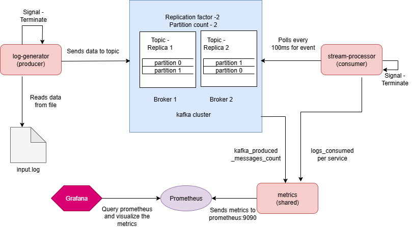
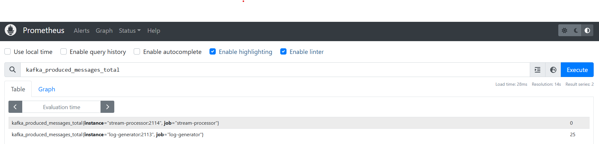
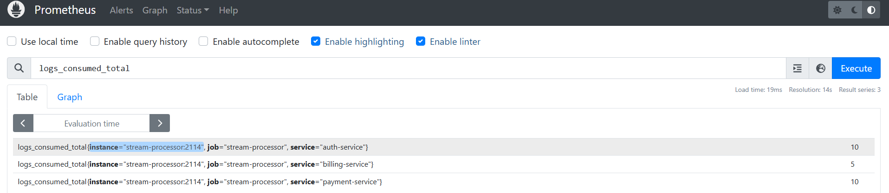
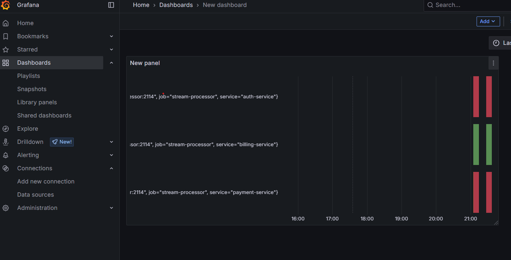

# go-observability
 A lightweight observability pipeline built with **Go** and **Apache Kafka** to simulate centralized logging and monitoring. The system reads log events from a file, streams them to **Kafka**, and consumes them for monitoring or analytics through **Grafana**

## Features

- Reads structured logs from a file
- Streams logs to Apache Kafka using a Go producer
- Partitioned by service name for log segregation
- Integrated with Grafana and prometheus for visualization

## Architecture



## Components
### 1. **Log Generator**
- Reads logs from a file.
- Sets Kafka message `key` as the service name.
- send the message to the partition based on the service name
- Exposes **Prometheus metrics** for:
  - Total number of messages produced
### 1. **Stream Processor**
- Reads logs from Kafka topic.
- Parses log level and service name from each message.
- Exposes **Prometheus metrics** for:
  - Total logs per service

### 4. **Prometheus**
- Scrapes metrics from the log-generator and stream-processor.
- Stores time-series data.

### 5. **Grafana**
- Visualizes Prometheus metrics via dashboards.

## Getting Started

### Prerequisites
- Docker and Docker Compose
- Go 1.24

## Setup
### 1. Clone the Repository
```bash
git clone https://github.com/srilak/go-observability.git
cd go-observability
```

### 2. Start all the services
```bash
docker-compose up --build
```
This starts:

Kafka brokers(kafka1 and kafka2)
Zookeeper
Prometheus
Grafana
log-generator(producer)
stream-processor(consumer)

### Configuration

Input logs(Producer)

path: /app/input.log (inside docker container)

```
auth-service:User login success
payment-service:Transaction approved
billing-service:Invoice generated
```
### Kafka Topic
Topic name: stream-Topic
Key: service-name
Value: Raw log line

### Prometheus metrics

kafka_produced_messages_total - Total messages produced to Kafka
logs_consumed_total - Total logs consumed from Kafka per service





### Grafana Dashboard
1. Go to localhost://3000
2. Login default(admin/admin)
3. Add prometheus as datasource(http://prometheus:9090)
4. Create a dashboard and add query to visualize the traffic of
    - how many messages(logs) produced by kafka
    - how many messages(logs) consumed per service



### Project Structure
```bash
 -go-observability
    |-constants
        |-constants.go
    |-images
        |-Architecture.png
        |-Grafana.png
        |-prometheus_log_generator.png
        |-prometheus_stream_processor.png
    |-log-generator
        |-main.go
        |-main_test.go
    |-metrics
        |-metrics.go
    |-stream-processor
        |-main.go
        |-main_test.go
    |-docker-compose.yml
    |-Dockerfile
    |-go.mod
    |-go.sum
    |-input.log
    |-prometheus.yml
    |-README.md
```

### Cleanup

```bash
docker-compose down -v
```
### Improvements
- Add SSL communication between the producer and consumer
- Add Log level to the input logs and add alert if the error logs are more
